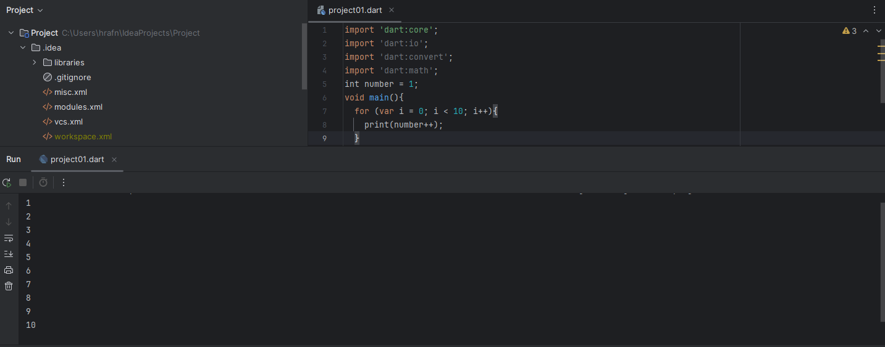
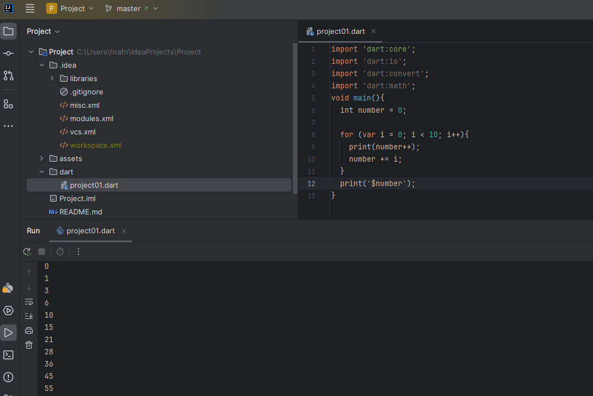
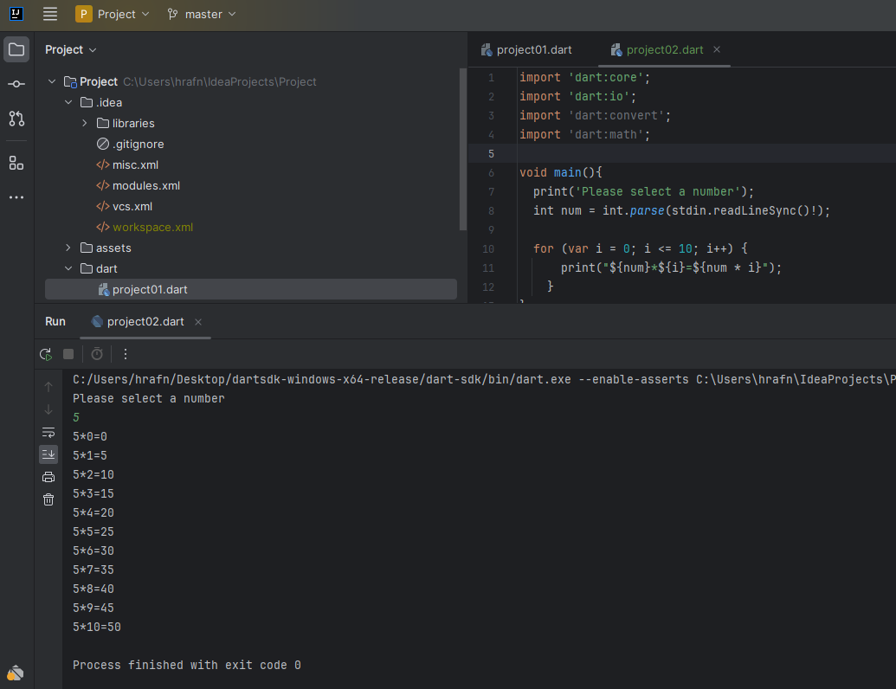

# Project-NTV
NTV-Dart-Flutter
<h1>Criteria</h1>
<h2>Turn-in instructions:</h2>

    This assessment must be turned in via Git at github.com
    Each solution must be in a separate file, within the same project.
    Please add pictures of final output.

<table>
  <tr>
    <th>Assignment 1.</th>
  </tr>
  <tr>
    <td>Using a for-loop, write a program that prints the first 10 natural numbers (1 to 10) and prints out their
    sum. The for-loop should be responsible for adding each number to it’s previous sum. Finally print the
    sum. The correct sum is 55.</td>
  </tr>
  <tr>
    <th>Assignment 1 Results.</th>
  </tr>
    <tr>
      <td>
         
         
      </td>
  </tr>
  <tr>
    <th>Assignment 2.</th>
  </tr>
  <tr>
    <td>Write a program that accepts input number from user and prints the multiplication (1-10) table of the
    given number using for loop. Program should be able to accept any number - the example below only
    demonstrates if the users enters 5. 
    Example Input 
    Input num: 5 
    Output 
    • • 5 * 1 = 5 
    • • 5 * 2 = 10 
    • • 5 * 3 = 15 
    • • 5 * 4 = 20 
    • • 5 * 5 = 25 
    • • 5 * 6 = 30 
    • • 5 * 7 = 35 
    • • 5 * 8 = 40 
    • • 5 * 9 = 45 
    • • 5 * 10 = 50 
    </td>
  </tr>
  <tr>
      <th>Assignment 2 Results.</th>
  </tr>
  <tr>
      <td>
         
      </td>
  </tr>
    <tr>
    <th>Assignment 3.</th>
  </tr>
    <tr>
    <td>Write a program to read 5 numbers from keyboard, using a loop. The program should work with any 5
    numbers. Program ends by printing out the sum and average of the numbers.</td>
  </tr>
    <tr>
    <th>Assignment 4.</th>
  </tr>
    <tr>
    <td>Write a program that accepts a number from the user and counts the number of digits in the given 
    integer using loop. 
    Example Input 
    Input num: 24967 
    Output 
    Number of digits: 5 
    Here is the step-by-step algorithm to solve this challenge. 
    (a) Input a number from user. Store it in some variable say num. 
    (b) Initialize another variable to store total digits say digit = 0. 
    (c) If num > 0 then increment count by 1 i.e. count++ 
    (d) Divide num by 10 to remove last digit of the given number i.e. num = num / 10. 
    (e) Repeat step c and d till num > 0 or num != 0. 
    </td>
  </tr>
</table>
<h1>Technologies</h1>
<ol>
    <li>
        <h3>Git</h3>

         
        Why <a href="https://git-scm.com/" target="_blank">Git</a>: 
        Git is a DevOps tool used for source code management. It is a free and open-source version control system used to handle small to very large projects efficiently. Git is used to tracking changes in the source code, enabling multiple developers to work together on non-linear development.
        

    </li>
    <li>
        <h3>Github</h3>

         
        Why <a href="https://github.com/" target="_blank">Github</a>: 
        Well It's used for storing, tracking, and collaborating on software projects. It makes it easy for developers to share code files and collaborate with fellow developers on open-source projects. GitHub also serves as a social networking site where developers can openly network, collaborate, and pitch their work 
        

    </li>
    <li>
        <h3>Dart</h3>

         
        Why <a href="https://dart.dev/" target="_blank">Dart</a>: 
        Being a compiled language, Dart allows developers to discover programming errors during the compilation process. 
        Hence, it is considered a type-safe language. 
        On the other hand, 
        Java is an interpreted language and allows developers to find programming errors during the runtime.
        

    </li>
    <li>
        <h3>Intellij</h3>

         
        Why <a href="https://www.jetbrains.com/idea/" target="_blank">Intellij</a>: 
        Apart from providing smart navigation and coding assistance, 
        IntelliJ IDEA integrates the essential developer tools and lets you debug, analyze, 
        and version the code base of your applications from within the IDE 
        <small><a href="https://www.jetbrains.com/idea/download/?section=windows" target="_blank">Download here</a></small>
        

    </li>
</ol>